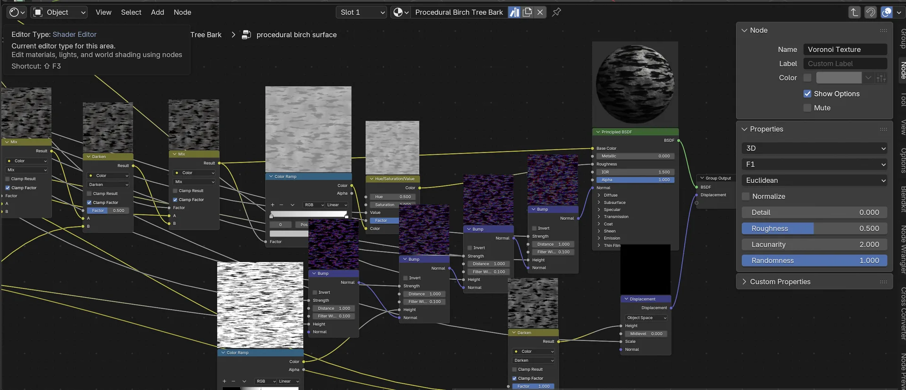
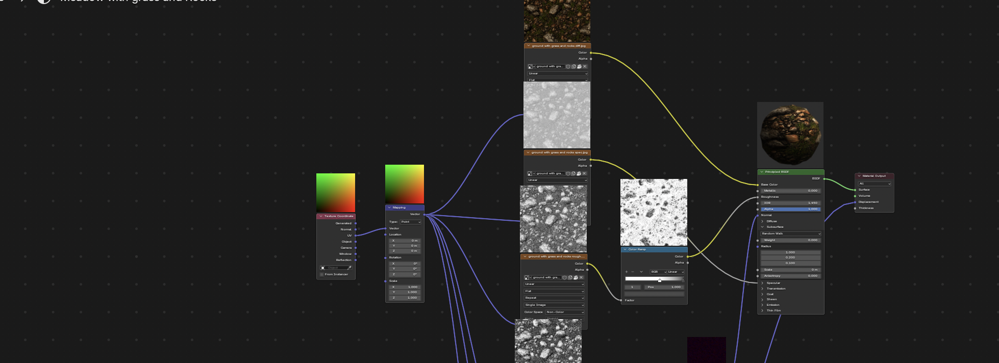

# Node Peek

**Live rendered thumbnail previews above every node in the Blender Shader Editor.**

Node Peek renders a small thumbnail of each node's output and draws it above the
node, updating as you work — so you can *see* what every node in your shader is
doing without plugging it into the output.

Previews are computed by a separate background Blender process, so your UI stays
responsive and **nothing is ever written into your .blend file**.

> An independent, clean-room implementation inspired by the idea behind the
> commercial "Node Preview" add-on. It shares none of that product's code.

Requires **Blender 4.2+**. Works on macOS, Linux, and Windows.

## Install

1. Download `node_peek.zip` (or zip the `node_peek/` folder yourself).
2. Blender → Edit → Preferences → Add-ons → **Install from Disk…** → pick the zip.
3. Enable it. Open a Shader Editor and select an object with a node material.

## Usage

- Previews appear above nodes automatically (when *Previews Visible By Default*
  is on).
- Sidebar (**N**) → **Node Peek** tab for controls (Refresh, Clear, resolution).
- **Ctrl+Shift+P** — toggle previews on the selected nodes (used when
  *Previews Visible By Default* is off).
- Enter a node group (**Tab**) and its interior nodes get previews too.

| Preference | Meaning |
|---|---|
| Previews Visible By Default | Show previews on all nodes, or only manually-enabled ones |
| Thumbnail Resolution | 32–512 px render size per node |
| Update Delay | Debounce after the last edit before re-rendering |
| Render Engine | Cycles (reliable) or EEVEE (experimental — often black in background) |

## How it works

- A **single** background Blender (`blender --background`, running `worker.py`)
  starts once and stays alive — no per-edit startup cost. Requests are sent over
  the worker's **stdin**: it blocks on read (zero idle CPU) and exits on EOF if
  Blender closes the pipe, on any platform.
- On a change, the add-on writes just the **active material** (`libraries.write`,
  not the whole .blend) and sends a request. A cheap tree fingerprint suppresses
  requests when nothing preview-relevant changed (e.g. selecting a node).
- The worker hashes each node's content — everything upstream, node-group
  internals, and image file mtimes. Only nodes whose hash isn't **already cached**
  are re-rendered; the rest are reused instantly. The cache survives undo/redo
  and reverted tweaks.
- Results are **streamed**: the node you're editing renders first and appears
  immediately, without waiting for the whole job.
- Texture/color/vector nodes render as a flat **map** (orthographic plane +
  emission, 1 sample — noise-free). Real shader nodes render as a shaded
  **sphere** (adaptive sampling + denoise).
- Image texture datablocks are **cached across jobs**; renders land in the cache
  via atomic rename (a killed worker can't corrupt it); GPU textures are
  content-addressed and shared between nodes with identical output.
- **Custom nodes from other add-ons** (`ShaderNodeCustomGroup`) are supported:
  the worker registers lightweight stub types so they render exactly as they do
  in your own scene — including everything downstream of them.

| Situation | Cost |
|---|---|
| First open of a material | Renders every node once (fills the cache) |
| Tweak one node's value | Re-renders that node + downstream only, edited node first |
| Undo / revert a value | Instant — served from cache |
| Switch object / material | Cached nodes instant, new ones rendered |
| Select / move a node | No render (fingerprint unchanged) |
| Idle | Worker blocked on stdin — zero wake-ups |

## Node groups

Entering a group shows per-node previews **inside** it, rendered for the specific
instance you navigated through (its inputs are baked in) by temporarily routing
each node's output through the group interface in the throwaway worker copy —
your file is never touched. Arbitrary nesting depth is supported.

A group used by several instances resolves to **one representative instance**
when you step in (the first found); with a single instance it is exact.

## Known limitations

- Multiple Shader Editors open at **different group depths** at once: only the
  one showing the active material (first found) has its interior rendered.
- Painting into a **packed** image doesn't invalidate the cache (no file mtime) —
  use **Refresh Previews**.
- Previews render the **Surface** shader only: a material driven by the Material
  Output **Displacement** input shows its bump/normal detail but not the
  displaced silhouette.
- Collapsed (hidden) nodes are skipped.
- Add-on nodes that are **not** custom groups (pure-Python nodes, nodes from
  other render engines) can't be rendered by Cycles — in your own render
  either — so they get no thumbnail rather than a misleading flat one.
- View transform is forced to **Standard**, so previews won't match an
  AgX/Filmic look.
- World and Geometry Nodes trees are not handled (Shader Editor only).

## Troubleshooting

The background worker logs to `worker.log` (its path is printed to Blender's
console — Window → Toggle System Console — on the first render). If previews
don't appear, that log shows whether renders are failing and why. **Refresh
Previews** re-renders everything ignoring the cache.

## Credits

Built by **mlstr0m** — [Résidence Principale](https://residenceprincipale.net).

## License

GPL-3.0-or-later. See [LICENSE](LICENSE). (Blender add-ons must be GPL-compatible
because they link against Blender's Python API.)

## Contributing

Issues and pull requests welcome. The whole add-on is two files: `__init__.py`
(the Blender-side UI, drawing, and IPC) and `worker.py` (the background renderer).
